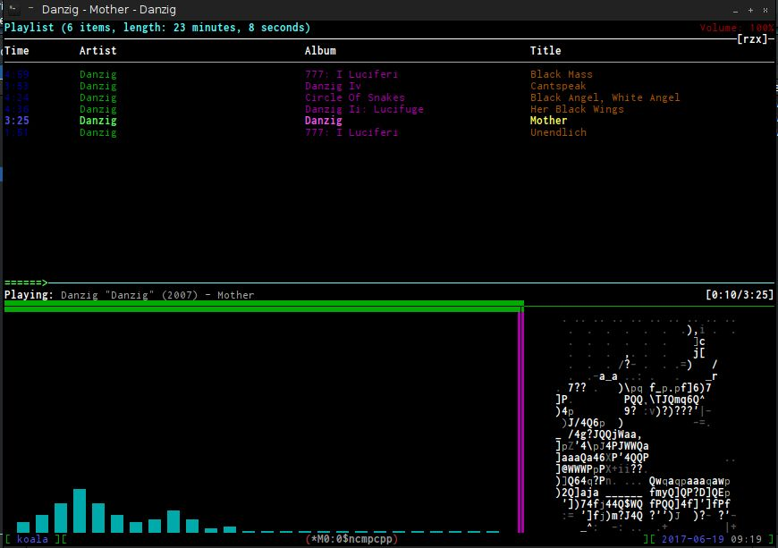

yolo-mpd
========

Various MP3 and MPD tweaks, tips, tools, and scripts I've put together 
or found and tweaked.

## Contents
 1. [ffixer](ffixer)
 2. [ffixer-covers](ffixer-covers)
 3. [mpdcontrol.sh](mpdcontrol.sh)
 4. [terminal-multiplexer](terminal-multiplexer)
 5. [bpmhelper](bpmhelper)
 6. [mp3gainhelper](mp3gainhelper)
 7. [webserver.covers.sh](webserver.covers.sh)
 8. [terminalcovers.sh](terminalcovers.sh)
 9. [mediakey.sh](mediakey.sh)

# ffixer

Dependencies: 
 * [eye3D](http://eyed3.nicfit.net/)
 * `grep` command-line tool. `grep` can be found in the `grep` package on major Linux distributions.
 * `sed` command-line tool. `sed` can be found in the `sed` package on major Linux distributions.

This utility does a few things automatically that I like to keep my 
collection in order.  

First, it finds MP3 files that have song titles 
like "Scratches All Down My Back (Buckcherry vs.Toto)" and moves the 
artists that are in the parentheses or brackets to the "Album Artist" 
field. Searches recursively from the directory you run it in, and 
stores a CSV of changes made in your $HOME directory. Use --dryrun as 
an option first if you like.

Second, it fills in the album artist and composer fields if they are 
empty, preferentially using the artist tag. I like this because different 
music players sort "artists" using different fields.

Third, it standardizes all the "date" fields (release date, original 
release date, and recording date) to YYYY *only* and fills in any 
empty fields.

Finally, it does all this while preserving the original file 
modification time so that your collection isn't a flying mess of "new" 
tracks.

# ffixer_covers

This script walks recursively from the directory it starts from and 
ensures there are *both* `cover.jpg` and `folder.jpg` files. If none 
exists in the directory, it attempts to extract them from the ID3 tags. 

It will also embed found cover art into the ID3 tags if none exists, and 
will attempt (if not found in any of the above) to find a cover on the 
interwebs. 

Dependencies:

* [glyr](https://github.com/sahib/glyr)
* [eye3D](http://eyed3.nicfit.net/)
* [mpc](http://git.musicpd.org/cgit/master/mpc.git/)

# mpdcontrol.sh

Select whether you want to choose a playlist, or by album, artist, or 
genre. Clears playlist, adds what you chose, starts playing. The SSH 
version is for exactly that, especially if you don't have `pick` on 
that machine.

The `mpdcontrol_add.sh` file does *not* clear the queue so that you can add to 
the existing playlist.

Dependencies: 
* [pick](https://github.com/thoughtbot/pick)
* [mpc](http://git.musicpd.org/cgit/master/mpc.git/)

# terminal_multiplexer

Uses tmux, xterm, ncmpcpp, cava, and [terminal covers](https://github.com/uriel1998/yolo-mpd#terminalcoverssh) to provide a nice layout. Title set to screen by wmctrl.  No tmux.conf file needed.  Inspired by [this reddit post](https://www.reddit.com/r/unixporn/comments/3q4y1m/openbox_music_now_with_tmux_and_album_art/).

Dependencies: 
* [mpc](http://git.musicpd.org/cgit/master/mpc.git/)  
* [tmux](https://tmux.github.io/)  
* [ncmpcpp](https://github.com/arybczak/ncmpcpp)  
* [wmctrl](https://linux.die.net/man/1/wmctrl)  

One or more of the following:  

* [AA-lib](http://aa-project.sourceforge.net/aview/)
* [libcaca](http://caca.zoy.org/wiki/libcaca)
* [img2text](https://github.com/hit9/img2txt)

# bpmhelper.sh

Uses the bpm-tools package, which analyzes BPM quite nicely on linux, 
but then writes tags that overwrite album and genre tags. So this 
wrapper uses eyeD3 to determine if a BPM is already written, then 
analyzes the file, then uses eyeD3 to do the writing to the file. 
I already have eyeD3 for the album art script; a solution 
that does not rely on that dependency can be found 
at [bpmwrap](https://github.com/meridius/bpmwrap).

`bpm-tools` outputs error messages if you do not have id3v2 and sox with mp3 
headers already installed and thus makes the script fail. You can either tweak 
the script or install the packages `sox`, `libsox-fmt-mp3`, and `id3v2`.

Accepts two command line arguments (optional)

Use --save-existing to save existing data.  
Use --skip-existing to skip further analysis of those that have existing BPM
Use --quiet to suppress output (eyeD3 may still output to the screen)

Analyzes the current directory *and all subdirectories*.

Dependencies
* [bpm-tools](http://www.pogo.org.uk/~mark/bpm-tools/)
* [eye3D](http://eyed3.nicfit.net/)

# mp3gainhelper.sh

Performs mp3gain analysis and writes to id3 tags. The MP3Gain utility 
apparently writes by default to APE tags, which aren't used by MPD. 
But apparently mp3gain has issues corrupting ID3 data if you write 
directly to ID3 tags, and will just crash and abort if it runs into an 
error instead of continuing onward.

Accepts only one command line argument (optional) giving the directory 
to analyze. Otherwise analyzes the current directory *and all 
subdirectories*.

Dependencies: 
* [mp3gain](http://mp3gain.sourceforge.net/)
* ape2id3 from [MPD Wiki](http://mpd.wikia.com/wiki/Hack:ape2id3.py) or [this gist](https://gist.github.com/uriel1998/6333da780d44e59abbc1761700104329)

# webserver.covers.sh

Very simple script to make your album covers accessible by MPoD or 
other remote clients without exposing your entire music directory by 
copying the cover files to the webserver root. (You need to edit this, obvs.)

Dependencies:
* [rsync](https://en.wikipedia.org/wiki/Rsync)

# terminalcovers.sh

A kind of hack-y way to show terminal covers in the terminal.  Uses 
either AA-lib or libcaca.  AA-lib looks MUCH better, but doesn't 
automatically exit, so requires killall (yeah, that sucks).  You will 
need to *edit* the script to choose a different renderer.

Dependencies: 
* [mpc](http://git.musicpd.org/cgit/master/mpc.git/)

One or more of the following:  

* [AA-lib](http://aa-project.sourceforge.net/aview/)
* [libcaca](http://caca.zoy.org/wiki/libcaca)
* [img2text](https://github.com/hit9/img2txt)

### AA-lib output

### libcaca output

# mediakey.sh

This script uses the MPRIS interface to control your media players.  
Currently supported players include MPD, Pithos, Audacious, and Clementine

